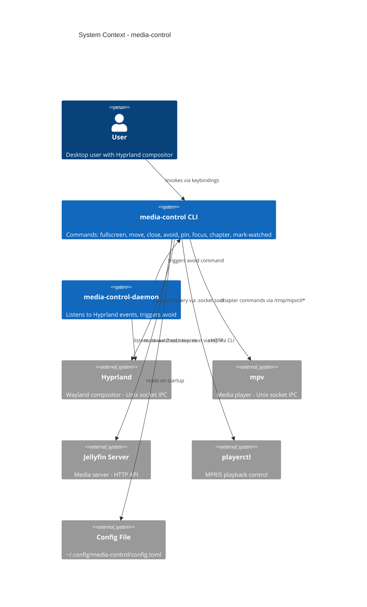

# Test and Refactor - System Context

## System Overview

media-control is a local desktop tool. It has no network-facing surface except outbound Jellyfin API calls. The "system" under test is the Rust codebase communicating with Hyprland via Unix sockets and optionally with a Jellyfin server via HTTP.

## Context Diagram

## External Integrations

- **Hyprland IPC** (.socket.sock): Request/response for window queries and dispatch commands. This is the primary integration to mock.
- **Hyprland Events** (.socket2.sock): Event stream for the daemon. Line-based protocol (`event>>data`).
- **mpv IPC** (/tmp/mpvctl*): JSON commands over Unix socket for chapter navigation.
- **Jellyfin HTTP API**: Session queries, mark-watched, playback control. Out of scope for mocking.
- **playerctl**: CLI invocation for mpv stop. Out of scope for mocking.
- **Config file**: TOML parsing, already well-tested.

## High-Level Constraints

- All testing must work without a running Hyprland instance
- Mock only the Hyprland request/response socket (not socket2 events)
- No new crate dependencies for mocking
- Jellyfin HTTP and playerctl remain tested only via unit/deserialization tests

## Key NFR Goals

- Every command logic path exercised by tests
- Refactored code verified by tests written BEFORE refactoring
- No regressions in existing 118 tests
