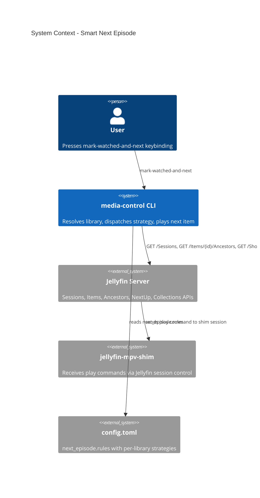

# Smart Next Episode - System Context

## System Overview

Extends the existing mark-watched-and-next command with per-library strategy dispatch. The system queries Jellyfin APIs to determine the library context and select the next item based on user-configured rules.

## Context Diagram

## Jellyfin API Endpoints Used

| Endpoint | Purpose | Strategy |
|----------|---------|----------|
| `GET /Sessions` | Find active mpv session | All |
| `GET /Items/{id}/Ancestors` | Determine library for current item | All (library detection) |
| `GET /Shows/{seriesId}/NextUp` | Next unwatched episode in series | next-up |
| `GET /Users/{id}/Items?ParentId={lib}&IsPlayed=false&SortBy=DateCreated` | Unwatched items sorted by date | recent-unwatched |
| `GET /Users/{id}/Items?ParentId={lib}&IsPlayed=false&SortBy=Random` | Random unwatched item | random-unwatched |
| `GET /Items/{boxsetId}/Items` | Items in a collection | series-or-random |
| `POST /Sessions/{id}/Command/Play` | Tell shim to play an item | All |

## High-Level Constraints

- Must work with existing jellyfin-mpv-shim session control
- All API calls use existing credential/auth system
- Config extends existing TOML format
- Strategy errors must not prevent mark-watched from succeeding
