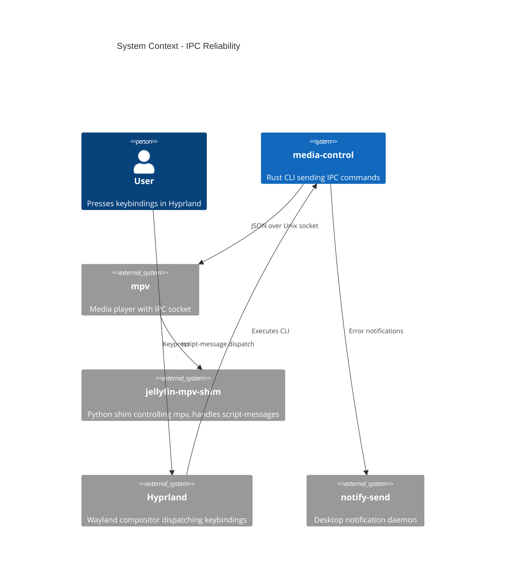

# IPC Reliability - System Context

## System Overview

media-control is a CLI tool that sends commands to mpv (via jellyfin-mpv-shim) over Unix domain sockets. The IPC path is: keypress → Hyprland binding → media-control CLI → mpv IPC socket → jellyfin-mpv-shim script-message handler.

## Context Diagram

## External Integrations

- **mpv IPC socket**: Unix domain socket at `/tmp/mpvctl-jshim` (primary) or `/tmp/mpvctl0` (fallback). JSON protocol: `{"command":["script-message","<cmd>"]}\n` → `{"error":"success"}\n`
- **jellyfin-mpv-shim**: Registers IPC_COMMANDS dict in player.py. Handles mark-watched-next, skip-next, skip-prev, stop-and-clear, play-next-strategy.
- **notify-send**: Desktop notification for error feedback. Available on user's Arch/Hyprland setup.

## High-Level Constraints

- Must use tokio async runtime (existing Rust workspace)
- Socket paths are fixed by mpv `--input-ipc-server` flag
- mpv dies and respawns frequently; socket may be stale or missing during respawn window

## Key NFR Goals

- Command latency < 200ms happy path, < 800ms with retry
- 100% error visibility (no silent failures)
- Graceful handling of stale/missing/non-socket paths
