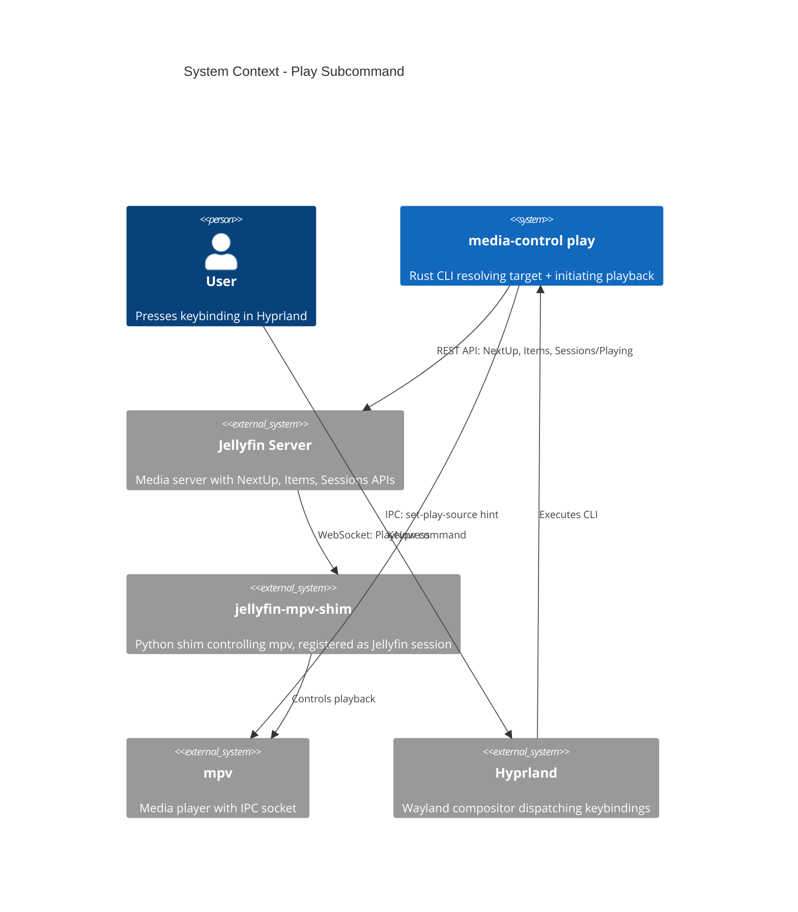

# Play Subcommand - System Context

## System Overview

The `play` subcommand is a one-shot CLI invocation triggered by Hyprland keybindings. It resolves a playback target via the Jellyfin API, sends an IPC hint to the local mpv/shim, then tells Jellyfin to start playback in the shim's session. Replaces shim-play.sh.

## Context Diagram

## External Integrations

- **Jellyfin REST API**: NextUp query, item detail (resume ticks), session discovery, PlayNow command. Auth via MediaBrowser token from `~/.config/jellyfin-mpv-shim/cred.json`.
- **mpv IPC socket**: `set-play-source` hint sent before PlayNow. Uses hardened `send_mpv_ipc_command()` from intent 004.
- **jellyfin-mpv-shim**: Not called directly — Jellyfin relays PlayNow to the shim's WebSocket session.

## High-Level Constraints

- IPC hint must arrive before PlayNow (local IPC < 1ms vs Jellyfin round-trip 50-200ms)
- No new crate dependencies
- Reuses existing JellyfinClient, credentials, session discovery, IPC infrastructure
- One-shot CLI, no daemon mode

## Key NFR Goals

- Total latency < 200ms (3 HTTP requests + 1 IPC write)
- Specific error messages for each failure mode
