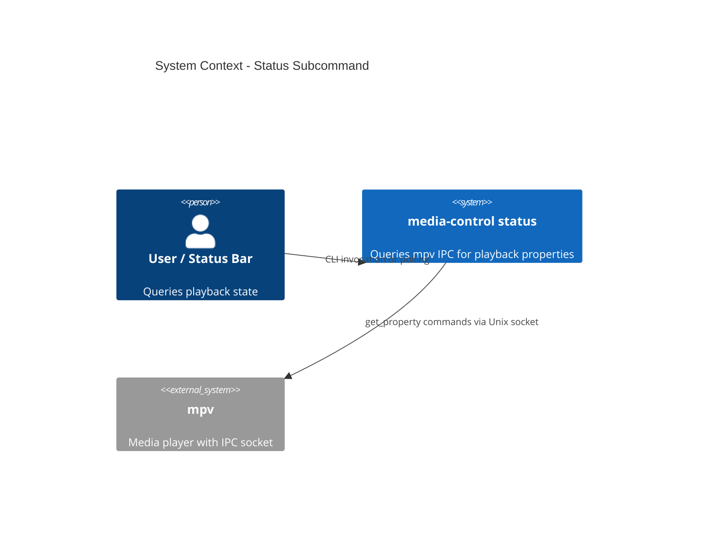

# Status Subcommand - System Context

## System Overview

The `status` command is a lightweight query tool that reads mpv playback state via IPC socket. No Hyprland or Jellyfin dependency — just direct mpv IPC. Designed for status bar integration and scripting.

## Context Diagram

## External Integrations

- **mpv IPC socket**: `get_property` commands for media-title, playback-time, duration, pause. Single connection, 4 commands, 4 responses.

## High-Level Constraints

- No Hyprland or Jellyfin dependency
- Fast: single attempt, no retry, 200ms timeout
- Exit code 0 = playing, 1 = not playing

## Key NFR Goals

- < 50ms response for status bar polling suitability
