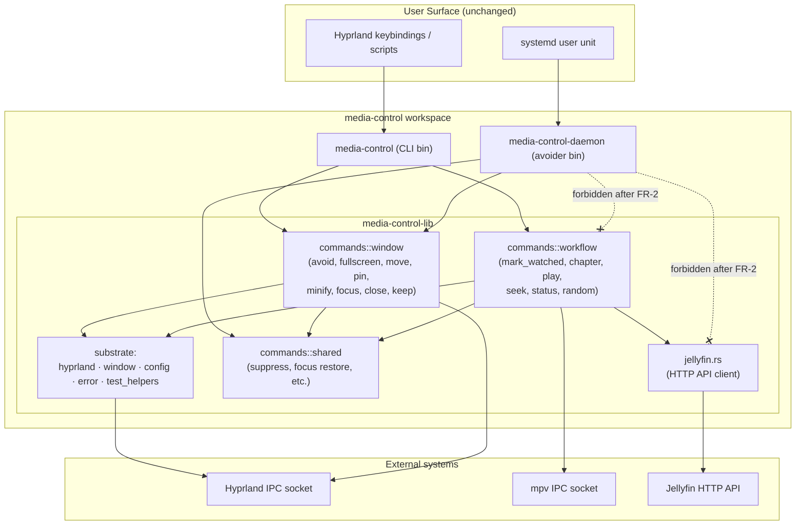

# Avoider Daemon Carve-Out - System Context

## System Overview

The `media-control` workspace ships two binaries today:

- `media-control` — the CLI; one-shot subcommands invoked from keybindings, scripts, and other tools.
- `media-control-daemon` — the long-running avoider; subscribes to Hyprland's IPC event socket, debounces events, and dispatches `avoid()` to keep media windows clear of the focused window.

Both link `media-control-lib`, which today contains everything: the Hyprland IPC client, window matching, config loader, error types, the Jellyfin HTTP client, and a flat `commands/` module holding 14 subcommand implementations across both concerns.

After the carve-out, the binaries are unchanged externally. Internally:

- `media-control-lib` grows two visible subnamespaces — `commands::window` (avoider-relevant) and `commands::workflow` (CLI-only) — sharing a `commands::shared` helper module and the substrate (`hyprland`, `window`, `config`, `error`, `test_helpers`).
- `media-control-daemon` is contractually limited to substrate + `commands::window` + `commands::shared`. Importing `commands::workflow` or `jellyfin` is a compile error.
- `media-control` (CLI) imports both subnamespaces freely; composite commands like `mark-watched-and-stop` keep working unchanged.

## Context Diagram

## External Integrations

- **Hyprland IPC** — Unix sockets at `$XDG_RUNTIME_DIR/hypr/$HIS/.socket{,2}.sock`. Used by both the avoider (event subscription + `dispatch` calls) and CLI window-management commands.
- **mpv IPC** — Unix sockets per running mpv instance. Used only by the workflow commands (mark_watched, chapter, play, seek, status, random) and `keep`.
- **Jellyfin HTTP API** — Reached via `reqwest` from `jellyfin.rs`. Used only by `mark_watched` (and any workflow command that needs server-side state). Daemon never touches it.

## High-Level Constraints

- Single workspace, no repo split.
- No new top-level crates introduced by this intent.
- No public CLI surface changes.
- No new runtime dependencies.
- Linux/Hyprland only (already true).

## Key NFR Goals

- **Module discipline is enforced, not aspirational.** "The daemon doesn't need Jellyfin" must become a property the build proves, not a habit contributors maintain.
- **Hot path gets faster, not just prettier.** The cleanup pass targets concrete syscall and allocation reductions (FR-3, FR-4), guided by the audit hit list.
- **Test infrastructure stays single-source.** `test_helpers.rs` remains the one mock layer; the daemon does not grow its own.
