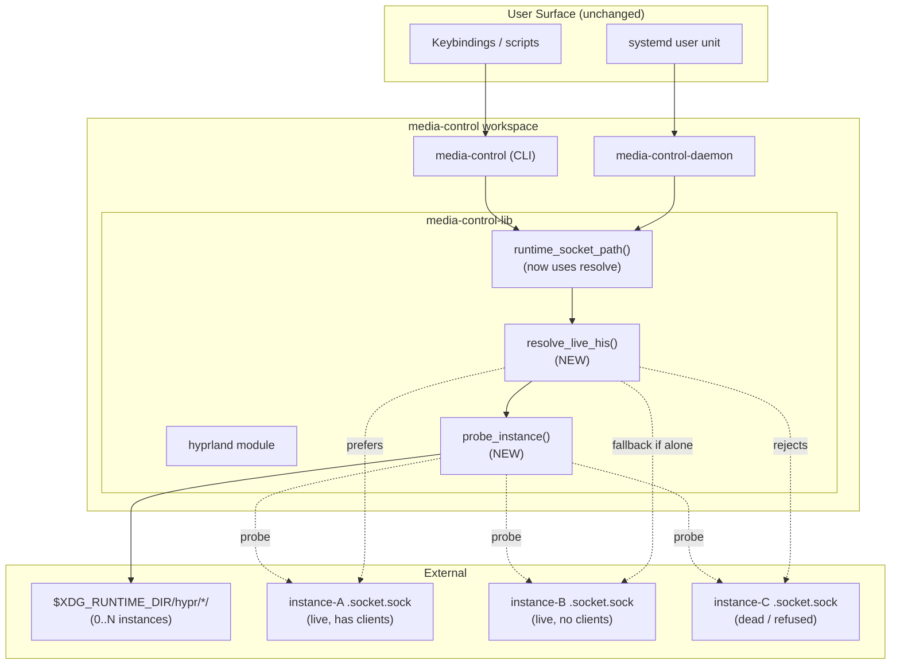

# Daemon Live-HIS Resolution - System Context

## System Overview

`media-control-lib::hyprland::runtime_socket_path()` resolves a Hyprland socket path from `HYPRLAND_INSTANCE_SIGNATURE`. Today it is a thin wrapper that does no liveness check. Both the long-running daemon (`media-control-daemon`) and every short-lived CLI invocation (`media-control`) rely on it.

After this intent, the same function probes available HIS dirs and prefers a *live* instance over what the env var names — but still honors the env var when it points to something live, so multi-seat / nested-Hyprland setups keep working. The daemon's reconnect loop re-resolves on every attempt so a Hyprland restart mid-session is recovered without daemon restart.

## Context Diagram

## External Integrations

- **Hyprland IPC sockets** — Per-instance `.socket.sock` (request/reply) and `.socket2.sock` (event stream) under `$XDG_RUNTIME_DIR/hypr/$HIS/`. Both can exist for multiple instances simultaneously. Probe uses `.socket.sock` with `activewindow` because it has a defined "is there anything here" reply (`Invalid` for empty), unlike socket2 which is event-stream-only.
- **`HYPRLAND_INSTANCE_SIGNATURE` env var** — Set by Hyprland at instance startup. Inherited by services via systemd's user-bus environment. Subject to drift when multiple Hyprland instances exist or when `hyprland.service` restarts and re-imports a new value.

## High-Level Constraints

- Single workspace, no repo split.
- No new top-level crates.
- No new runtime dependencies — `tokio::net::UnixStream` already present and sufficient for probing.
- No public CLI surface changes; existing systemd unit unchanged.
- Linux/Hyprland only (already true).
- Per intent 015 carve-out: probe + resolution lives in **substrate** (`hyprland` module), not in any `commands/` submodule. Reachable from both CLI and daemon without crossing the `commands::window` / `commands::workflow` boundary.

## Key NFR Goals

- **Probing must be fast.** Startup overhead < 100ms even with several HIS dirs; per-probe deadline ≤ 1s so a wedged Hyprland cannot block the daemon. Concurrent probes.
- **No regression on single-instance hosts.** Most users have exactly one Hyprland; for them, the new path must be indistinguishable from the old one (modulo a single fast probe).
- **Test coverage matches intent 015 discipline.** All probe cases — live-with-clients, live-empty, dead, no-HIS-dir, stale env, multi-live — covered by mock-socket tests in `test_helpers.rs`. No parallel mock layer in the daemon.
