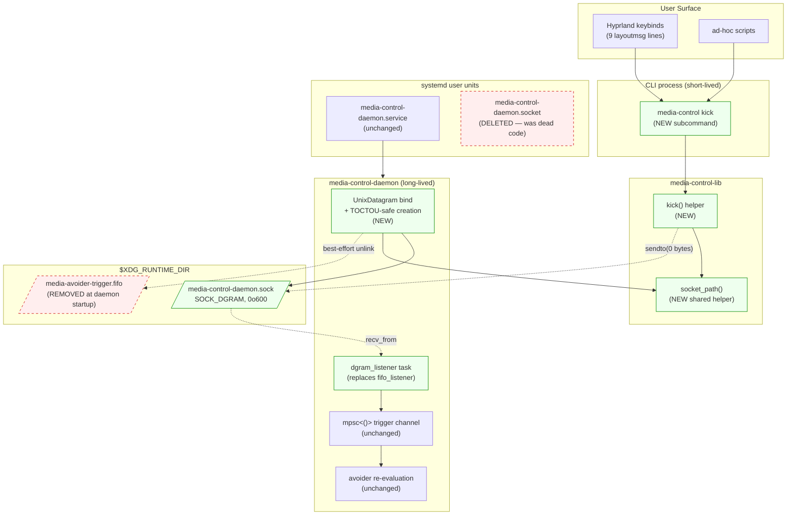

# Replace FIFO trigger IPC with `SOCK_DGRAM` UNIX socket — System Context

## System Overview

The daemon (`media-control-daemon`) runs continuously as a systemd user service and is the in-process consumer of two transports:

1. **Hyprland `.socket2.sock` event stream** — inbound only; the avoider re-evaluates window placement on relevant Hyprland events (active window changed, layout reshuffled, etc.). Unchanged by this intent.
2. **External "kick" trigger** — currently a FIFO at `$XDG_RUNTIME_DIR/media-avoider-trigger.fifo`; called by Hyprland keybinds (`exec, hyprctl dispatch layoutmsg togglesplit && echo > $fifo`) and ad-hoc scripts. **This intent replaces this transport with a `SOCK_DGRAM` UNIX socket** at `$XDG_RUNTIME_DIR/media-control-daemon.sock`.

A first-class `media-control kick` CLI subcommand becomes the single sanctioned way to send a kick. The dead `systemd.user.sockets.media-control-daemon` unit (declared but never accepted on by the daemon) is removed.

## Context Diagram

## External Integrations

- **Hyprland keybind shell** — invokes `media-control kick` as part of an `exec` line. Requires kick to never block the shell longer than 100ms regardless of daemon state (FR-5). Today's FIFO `echo > $fifo` blocks indefinitely if no reader; this is the user-visible bug being fixed.
- **NixOS module** (`~/nix/modules/apps/media/media-control.nix`) — currently declares both `systemd.user.services.media-control-daemon` and a dead `systemd.user.sockets.media-control-daemon`. Post-intent: only the service unit remains. The daemon binds its own socket on startup; systemd doesn't hold the FD.
- **Hyprland config** (`~/.config/hypr/conf.d/common.conf`) — 9 layoutmsg keybinds added 2026-05-01 currently end with `&& echo > "$XDG_RUNTIME_DIR/media-avoider-trigger.fifo"`. Post-intent: replaced with `&& media-control kick`.
- **Legacy FIFO at `$XDG_RUNTIME_DIR/media-avoider-trigger.fifo`** — removed by daemon at startup (FR-8). Best-effort; failure is debug-logged and ignored.

## Data Flows

### Inbound to daemon

| Source | Transport | Format | Volume |
|--------|-----------|--------|--------|
| `media-control kick` (keybind/script) | `SOCK_DGRAM` recv | 0-byte datagram (canonical kick); future versions: `[ver, …payload]` | Bursty around layoutmsg interactions; ≤ 1 per keypress |
| Hyprland `.socket2.sock` | `SOCK_STREAM` line-delimited | Hyprland event lines | Continuous, varies with user activity |

### Outbound from CLI (`media-control kick`)

| Target | Transport | Format | Notes |
|--------|-----------|--------|-------|
| Daemon's bound socket | `UnixDatagram::send_to` | 0 bytes | Connectionless. Never blocks. `ECONNREFUSED`/`ENOENT` are silent (exit 0). |

## High-Level Constraints

- **Single workspace; no new top-level crates.** `tokio::net::UnixDatagram` is already transitively available.
- **No `libsystemd` / `sd_listen_fds()`.** The daemon binds its own socket. Explicit non-goal.
- **Lib helper is the single source of truth** for the socket path. Both daemon `bind()` and CLI `kick()` resolve via `media-control-lib::socket_path()` (or equivalent — exact name is a construction-stage choice). One constant for the filename so a future rename touches one place.
- **TOCTOU-safe socket creation** mirroring the existing `create_fifo_at` posture: `lstat → reject-symlink → reject-non-socket → reject-wrong-uid → unlink → bind`. **MUST not** follow symlinks at the bind path.
- **Test posture**: socket tests use `is_socket()` + bind-success assertions, **not** inode equality (per `media-control-t8d` lessons; see CLAUDE.md note about tmpfs inode reuse in the nix sandbox).
- **Cross-repo coordination**: `~/nix` module change and `~/.config/hypr/conf.d/common.conf` keybind migration are in scope (per Q5/Q6) and must land together with the in-repo daemon/CLI release for a single coordinated rollout (per Q7).

## Key NFR Goals

- **Kick latency end-to-end < 50ms p95** — keypress to `Processing trigger` log line.
- **`media-control kick` invocation < 100ms p99** under all daemon states (running / down / socket missing / socket non-writable).
- **No keybind shell hang under any daemon state** — the original motivating bug.
- **Recv-error CPU bounded ≤ 10%** under sustained `recv_from` error storms (mirrors `FIFO_ERROR_BACKOFF` posture).
- **Wire format never has to break**: 0-byte = canonical kick forever; non-empty datagrams reserved with version-byte prefix (FR-9). Future telemetry / structured commands extend without breaking the kick contract.

## Wire Protocol Reservation (FR-9 reference)

| Datagram length | Daemon behavior in this release | Reserved future use |
|----------------|-------------------------------|---------------------|
| 0 bytes | Canonical kick. Trigger one avoid pass via the `mpsc<()>` channel. | Stays canonical kick forever. |
| ≥ 1 byte, byte 0 = `0x01` | Ignore; `debug!` log line. | v1 envelope (likely UTF-8 JSON; carries `--reason`, etc.). |
| ≥ 1 byte, byte 0 = anything else | Ignore; `debug!` log line. | Reserved for future protocol versions. |

The CLI MUST NOT expose any flag that produces a non-empty datagram in this release.
